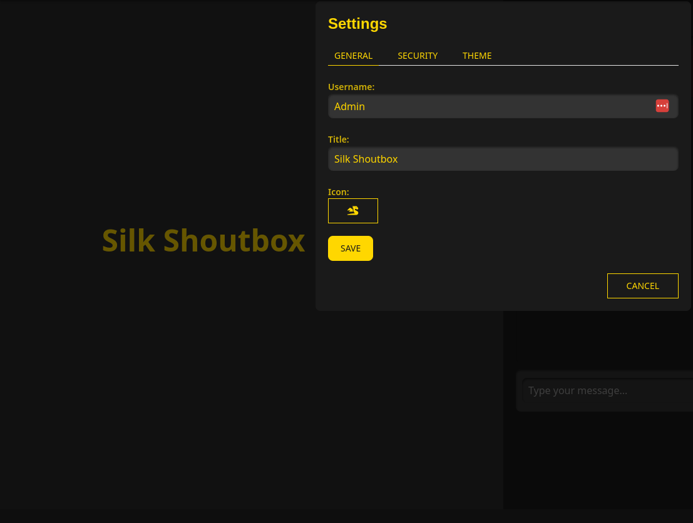

<div style="text-align: center;">
    
</div>


# $$\LARGE{\color{gold}Silk \space Shoutbox}$$

<br>
Silk is a lightweight, single-file PHP shoutbox designed for secure and private communication. The shoutbox operates without any setup requirements, logs, or external dependencies. All chat data is stored in an encrypted format, ensuring privacy and security.


## Features <br>

*  **No Setup Required:** Silk is a single-file shoutbox with no installation or configuration steps. Just upload and start using it.
*  **AES-256 Encrypted Data:** All chat data is stored securely using AES-256 encryption, ensuring that messages remain private.
*  **Admin Control:** The admin has the ability to control the chat environment, including generating a new access key, purging all stored chat data, and managing users. Admins can also edit the title, theme, and Giphy API key.
*  **User Authentication:** Users authenticate using a key provided by the admin, creating a unique user profile upon joining the chat.
*  **Customizable Profiles:** Users can customize their profile by changing their username and icon.
*  **Mentions:** Users can mention other participants in the chat by using the "@" symbol, creating a more interactive experience.
*  **GIF Integration:** If configured with a Giphy API key, users can search for and insert GIFs directly into their messages.
*  **Emoticons and Icons:** Users can select from a variety of emoticons and icons to express themselves in the chat.
*  **Theming:** Admins can customize the look and feel of the shoutbox, including background colors, text colors, and more.
*  **Data Purging:** The admin can delete all stored chat data at any time, resetting the environment and removing all traces of past conversations.

## Security and Privacy <br>
 
  * Encrypted Chat Data: All chat messages and user data are stored in an AES-256 encrypted format, ensuring that even if the data file is accessed, the contents remain secure.
  * No Logs: Silk does not store logs or any unencrypted information, ensuring that all interactions remain private.

## Data Management <br>
 
 * Purge Functionality: The admin can purge all data at any time, removing all stored messages and resetting the shoutbox to its initial state.
 * Single Data File: All data is stored within a single encrypted JSON file, making it easy to manage and secure.


## Installation

1. **Run Locally:**

   To run the shoutbox locally, you can use the built-in PHP server. Simply execute the following command in your terminal:

   ```bash
   php -S localhost:8080 silk.php
   ```

 2. **Hosting:**

    To deploy the Silk Shoutbox on a hosting platform, simply upload the shouts.php file to your server. No additional setup is required.

**Default admin key:** admin123 

   ## Screenshots 

   **Authentication**
   <br>
   
   
<br><br>
   **Main chat** 
   <br>
    
   
   <br>
   **Admin Settings** 
   
   <br> 
   
   

   **User Settings** 
   <br><br>
   

   
## License

This project is licensed under a Proprietary License.

© 2024 blue0x1 (Chokri Hammedi). All rights reserved.

This software is the proprietary information of blue0x1 (Chokri Hammedi). The source code is provided as-is, for personal use only. Redistribution, modification, or commercial use of this code is strictly prohibited without explicit permission from the author.

See the [LICENSE](./LICENSE) file for more details.
