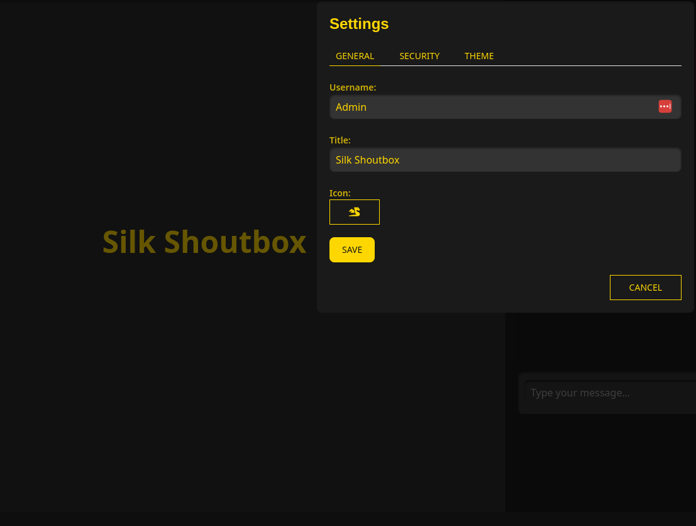

<p align="center">
  
</p>

# Silk Chat

Silk Chat is a lightweight, single-file PHP shoutbox for private communication. It runs without a database, framework, or setup process. Messages, users, access keys, settings, and theme preferences are stored locally in encrypted form.

The project is designed for small private rooms, temporary team chats, lab groups, and situations where you need a simple chat tool that can be deployed quickly and reset easily.

## Features

- **Single-file deployment:** Upload `silk.php` and run it on a PHP-enabled server.
- **Encrypted local storage:** Chat data is stored in encrypted form using AES-256.
- **Key-based access:** Users join with an access key generated by the admin.
- **Admin controls:** Generate new access keys, change the admin key, manage room settings, configure Giphy, customize the theme, and purge chat data.
- **User profiles:** Users can change their username and choose an icon.
- **Mentions:** Mention other users with `@username`.
- **Optional GIF support:** Add a Giphy API key to enable GIF search and insertion.
- **Theme customization:** Change background, primary, secondary, input, title, and admin message colors.
- **Data purge:** Reset the room and remove stored messages when needed.
- **Security controls:** Includes session hardening, CSRF protection, input validation, rate limiting, and HTTP security headers.

## Requirements

- PHP with the OpenSSL extension enabled
- A web server capable of running PHP
- Write permission in the application directory so Silk can create its encrypted data files
- HTTPS recommended for production use

## Installation

### Run Locally

Use PHP's built-in development server:

```bash
php -S localhost:8080 silk.php
```

Then open:

```text
http://localhost:8080
```

### Deploy to Hosting

Upload `silk.php` to your PHP-enabled server and open it in the browser.

Silk will create its local encrypted data files automatically on first run.

## Default Admin Key

The default admin key is:

```text
admin123
```

Change this key immediately after first login.

## Security Notes

- Change the default admin key before using Silk with other users.
- Use HTTPS in production.
- Keep generated files such as `data.json`, `encryption.key`, and `encryption.iv` protected from public web access.
- Restrict file permissions on the server where possible.
- Treat the generated user access key like a password.
- Purge the chat when a temporary room is no longer needed.

## Screenshots

### Authentication


### Main Chat


### Admin Settings



### User Settings


## License

This project is licensed under a Proprietary License.

© 2024 blue0x1 (Chokri Hammedi). All rights reserved.

This software is the proprietary information of blue0x1 (Chokri Hammedi). The source code is provided as-is, for personal use only. Redistribution, modification, or commercial use of this code is strictly prohibited without explicit permission from the author.

See the [LICENSE](./LICENSE) file for more details.
